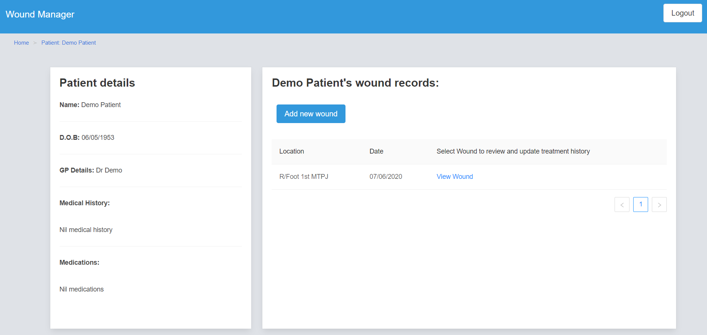
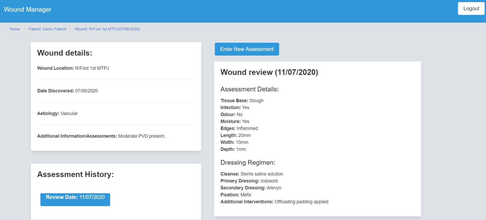
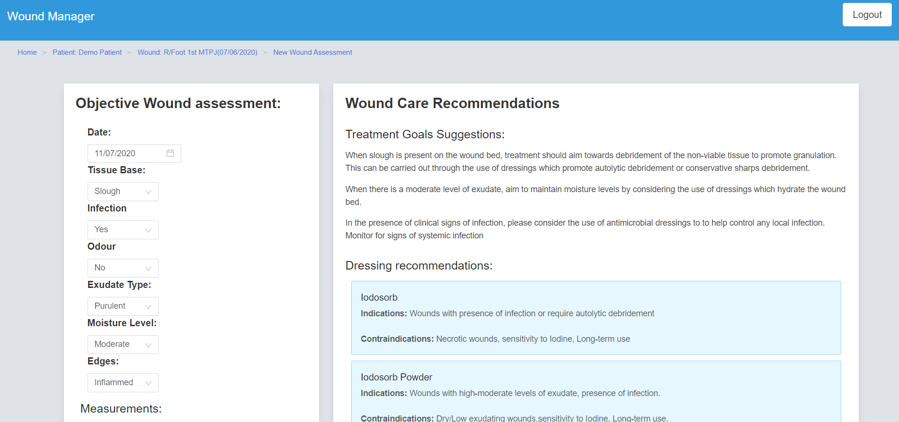

# Wound Manager

## Introduction: 
This application was created to aid healthcare workers involved in wound care.
It canbe used to record data to monitor wound reviews, keep track of objective assessment details and treatment plans for individual patients. 
This application differs to other electronic record wound record keeping I have come across during my career as a podiatrist as it also provides recommendations on treatment goals and dressing regimes based on user input into the objective assessment table. 

The application has been deployed on Heroku: https://lit-reaches-59072.herokuapp.com/

## Technologies used: 
* React
* Express
* Node.js
* MySQL
* Sequelize

## Future Development: 
* Addition of more thorough assessment and record keeping options.
* Individual user accounts within an organisation to maintain accountability of healthcare providers.

## Preview:

